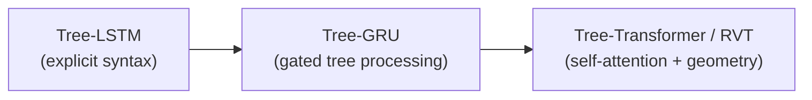

  

  
  

# 🌟 Awesome-Recursive-Language-Models
## Recursive Language Models: Evolution, Variants, & Applications

Recursive Language Models operate on tree-structured data networks rather than sequential data chains. Unlike standard Recurrent Neural Networks (RNNs) that process text sequentially from left to right, Recursive LMs build representations hierarchically by combining tokens into phrases, and phrases into sentences, following a structural syntax tree. 

---

## 🕰️ 1. The Chronological Evolution

The progression of tree-structured deep learning models traces a clear path from early static parsing networks to adaptive, transformer-hybrid modern architectures.

| Model | Concept | Year | First Paper |
| :--- | :--- | :--- | :--- |
| [**Recursive Autoencoders (RAE)**](docs/rae.md) | The foundational era. RAEs learned vector representations of phrases by recursively merging pairs of words using a fixed neural net layer until the entire sentence was reduced to a single vector. | 2011 | [Semi-Supervised Recursive Autoencoders for Predicting Sentiment Distributions](https://aclanthology.org/D11-1014/) |
| [**Tree-LSTM**](docs/tree-lstm.md) | The core breakthrough. Generalized standard sequential LSTMs to tree-structured topologies. Instead of having a single previous hidden state, a Tree-LSTM unit can integrate hidden states from multiple child nodes simultaneously. | 2015 | [Improved Semantic Representations From Tree-Structured Long Short-Term Memory Networks](https://arxiv.org/abs/1503.00075) |
| [**Recursive Transformer / Tree-Transformer**](docs/tree-transformer.md) | The modern convergence. Replaces classic recurrent matrix transformations with localized multi-head self-attention mechanisms bounded strictly by constituency phrase structures. | 2019 | [Tree Transformer: Integrating Tree Structures into Self-Attention](https://arxiv.org/abs/1909.06639) |

---

## 🌳 2. Structural & Parsing Variants

These structural types define how the underlying recursive execution tree is constructed and traversed during training or inference.

| Variant | Mechanism / Behavior | Year | First Paper |
| :--- | :--- | :--- | :--- |
| [**Constituency Tree Models (Fixed-Syntax)**](docs/constituency-tree-models.md) | **Mechanism:** Relies on an external, linguistic parser (like the Stanford Parser) to generate a static grammatical constituency tree before training begins. **Behavior:** Highly interpretable, but bound rigidly to strict grammatical syntax rules. | 2011 | [Parsing Natural Scenes and Natural Language with Recursive Neural Networks](https://ai.stanford.edu/~ang/papers/icml11-ParsingWithRecursiveNeuralNetworks.pdf) |
| [**Dependency Tree Models**](docs/dependency-tree-models.md) | **Mechanism:** The network topology mirrors the dependency relation structure of the sentence, focusing on word-to-word syntactic head relationships rather than abstract phrase blocks. | 2015 | [Improved Semantic Representations From Tree-Structured Long Short-Term Memory Networks](https://arxiv.org/abs/1503.00075) |
| [**Latent Tree Learning (Unsupervised Tree LMs)**](docs/latent-tree-learning.md) | **Mechanism:** The model does not receive a pre-computed linguistic tree. Instead, it uses a reinforcement learning policy or a continuous relaxation gate to discover its own optimal hierarchical parsing tree purely by minimizing next-token prediction loss. | 2016 | [Learning to Compose Words into Sentences with Reinforcement Learning](https://arxiv.org/abs/1611.09100) |

---

## 🧮 3. Mathematical & Cell-Level Types

These variations dictate how state transformations and data gates are handled inside each recursive intersection node.

| Cell-Level Type | Mechanism & Ideal For | Year | First Paper |
| :--- | :--- | :--- | :--- |
| [**Child-Sum Tree-LSTM**](docs/child-sum-tree-lstm.md) | **Mechanism:** Sums up the hidden states of all child nodes before pushing the combined vector through the standard LSTM forget and update gates. **Ideal For:** Multi-child dependent structures or unordered dependency trees where child position does not strictly matter. | 2015 | [Improved Semantic Representations From Tree-Structured Long Short-Term Memory Networks](https://arxiv.org/abs/1503.00075) |
| [**N-ary Tree-LSTM**](docs/n-ary-tree-lstm.md) | **Mechanism:** Maintains separate, unique parameter matrices for each child slot position (e.g., explicit Left-Child and Right-Child parameters). **Ideal For:** Strictly ordered binary branching trees (like constituency trees or binary arithmetic execution paths). | 2015 | [Improved Semantic Representations From Tree-Structured Long Short-Term Memory Networks](https://arxiv.org/abs/1503.00075) |

---

## 🚀 4. Specialized Production Applications

Because recursive models excel at capturing nested hierarchical geometries, they are heavily deployed in domains that rely on highly structured logic.

| Application | Description | Year | First Paper |
| :--- | :--- | :--- | :--- |
| [**Source Code Parsing & Abstract Syntax Trees (AST)**](docs/source-code-parsing.md) | **Application:** Compilers and AI coding tools use recursive models to read and validate programming syntax. Code is naturally nested (`if` blocks inside `loops` inside `functions`), making standard sequential modeling less optimal than processing raw Abstract Syntax Trees. | 2019 | [A Novel Neural Source Code Representation based on Abstract Syntax Tree](https://arxiv.org/abs/1903.10705) |
| [**Mathematical Formula Evaluation**](docs/mathematical-formula-evaluation.md) | **Application:** Symbolic computation and automated theorem proving engines rely on recursive language models to evaluate complex algebraic expressions or execute parenthetical logic tracking without breaking order-of-operation constraints. | 2016 | [Neural Equivalence Networks](https://arxiv.org/abs/1611.00711) |
| [**Fine-Grained Phrase Sentiment Composition**](docs/sentiment-composition.md) | **Application:** Applied to datasets like the *Stanford Sentiment Treebank (SST)*. It tracks exactly how adding a single negative word (e.g., "not") cascades up a grammatical tree branch to flip the emotional sentiment score of an entire sentence structure. | 2013 | [Recursive Deep Models for Semantic Compositionality Over a Sentiment Treebank](https://aclanthology.org/D13-1170/) |

---

## Star History

<a href="https://www.star-history.com/?repos=ishandutta2007%2FAwesome-Recursive-Language-Models&type=date&legend=bottom-right">
<picture>
<source media="(prefers-color-scheme: dark)" srcset="https://api.star-history.com/chart?repos=ishandutta2007/Awesome-Recursive-Language-Models&type=date&theme=dark&legend=bottom-right" />
<source media="(prefers-color-scheme: light)" srcset="https://api.star-history.com/chart?repos=ishandutta2007/Awesome-Recursive-Language-Models&type=date&legend=bottom-right" />

</picture>
</a>

