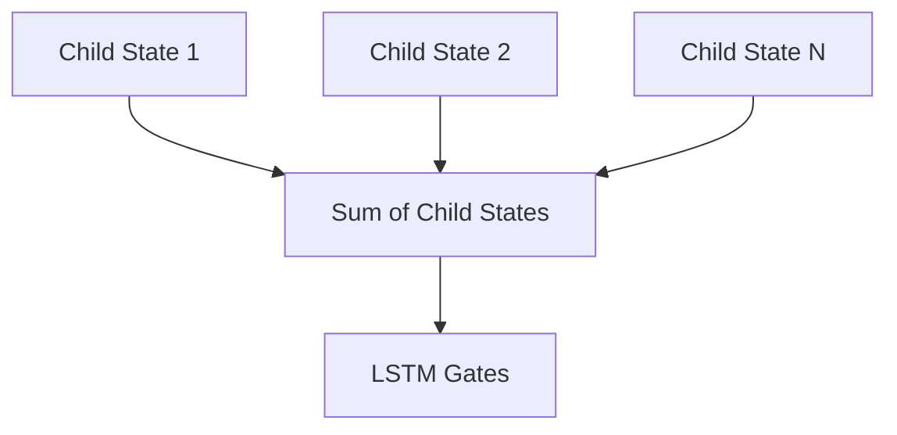

# Child-Sum Tree-LSTM

## Overview
The Child-Sum Tree-LSTM is a mathematical variant of the Tree-LSTM designed to handle nodes with a variable number of unordered children.

## Architecture & Mechanism
It sums up the hidden states of all child nodes before pushing the combined vector through the standard LSTM forget and update gates. This mechanism makes it ideal for multi-child dependent structures or unordered dependency trees where the specific position of a child (e.g., first vs. second) does not strictly matter.

## Diagram

## References
- [Improved Semantic Representations From Tree-Structured Long Short-Term Memory Networks](https://arxiv.org/abs/1503.00075)
