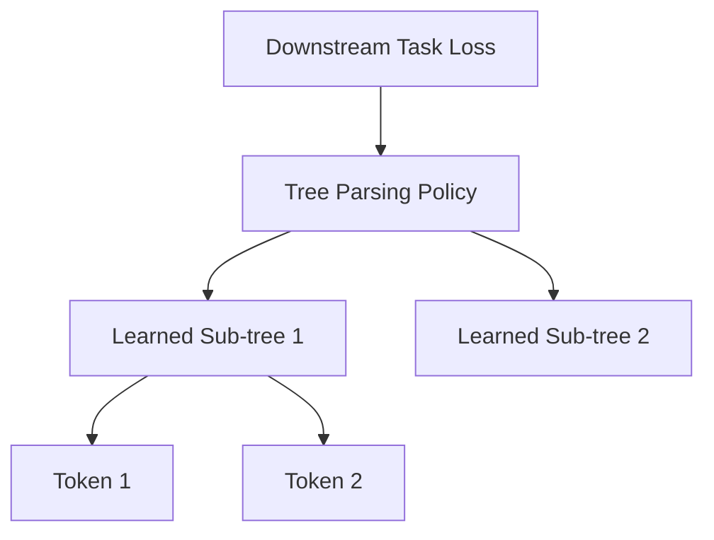

# Latent Tree Learning (Unsupervised Tree LMs)

## Overview
Latent Tree Learning models do not receive a pre-computed linguistic tree. Instead, they learn to parse and construct the tree structure dynamically during training.

## Architecture & Mechanism
The model uses a reinforcement learning policy or a continuous relaxation gate (like the Gumbel-Softmax trick or CYK-like algorithms) to discover its own optimal hierarchical parsing tree purely by minimizing a downstream objective, such as next-token prediction loss or classification error.

## Diagram

## References
- [Learning to Compose Words into Sentences with Reinforcement Learning](https://arxiv.org/abs/1611.09100)
