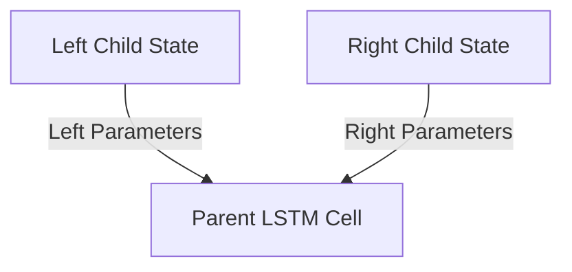

# N-ary Tree-LSTM

## Overview
The N-ary Tree-LSTM is a mathematical cell-level variant tailored for trees with a fixed maximum branching factor and strictly ordered children.

## Architecture & Mechanism
It maintains separate, unique parameter matrices for each child slot position (e.g., explicit Left-Child and Right-Child parameters). It is ideal for strictly ordered binary branching trees (like constituency trees or binary arithmetic execution paths) where the left child has a different semantic role than the right child.

## Diagram

## References
- [Improved Semantic Representations From Tree-Structured Long Short-Term Memory Networks](https://arxiv.org/abs/1503.00075)
