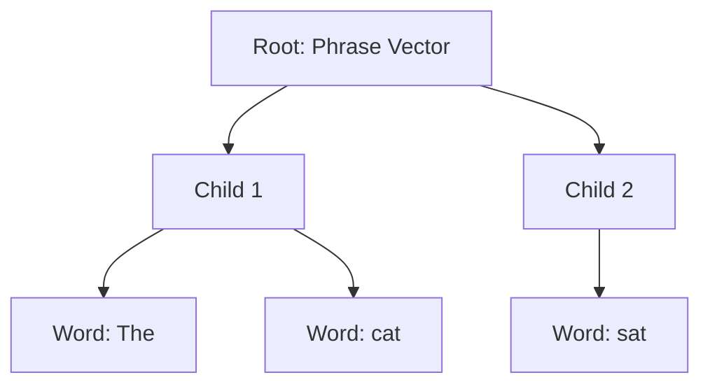

# Recursive Autoencoders (RAE)

## Overview
Recursive Autoencoders (RAE) represent the foundational era of tree-structured neural networks for natural language processing. Introduced around 2011 by Socher et al., RAEs learn vector representations of phrases by recursively merging pairs of words using a fixed neural network layer until the entire sentence is reduced to a single vector.

## Architecture & Mechanism
RAEs are built upon the concept of autoencoders, but applied recursively over a parse tree. The model takes two children vectors (e.g., word embeddings or previously computed phrase vectors), concatenates them, and passes them through a hidden layer to produce a parent vector. The autoencoder part attempts to reconstruct the original children from this parent vector to ensure the representation captures the necessary information.

## Diagram

## References
- [Semi-Supervised Recursive Autoencoders for Predicting Sentiment Distributions](https://aclanthology.org/D11-1014/)
