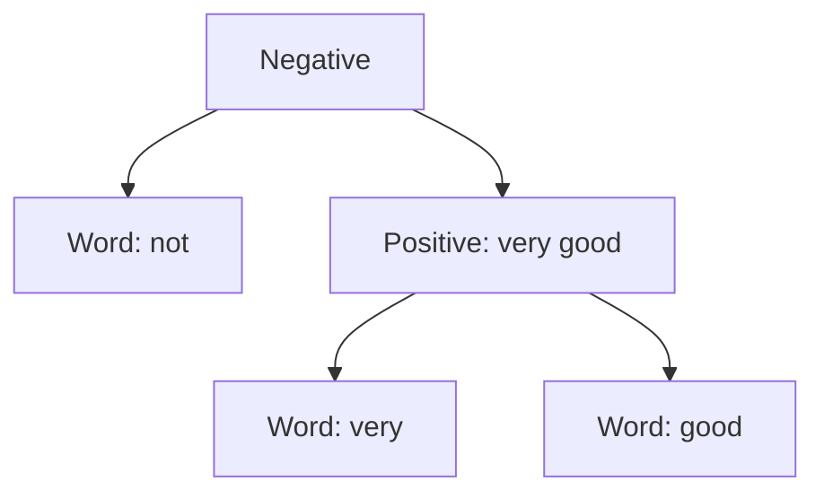

# Fine-Grained Phrase Sentiment Composition

## Overview
Recursive models are widely used for sentiment analysis over parse trees, enabling fine-grained phrase sentiment composition.

## Architecture & Mechanism
Applied to datasets like the *Stanford Sentiment Treebank (SST)*, a recursive model tracks exactly how the meaning of words combines. For instance, it can model how adding a single negative word (e.g., 'not') cascades up a grammatical tree branch to flip the emotional sentiment score of an entire sentence structure.

## Diagram

## References
- [Recursive Deep Models for Semantic Compositionality Over a Sentiment Treebank](https://aclanthology.org/D13-1170/)
