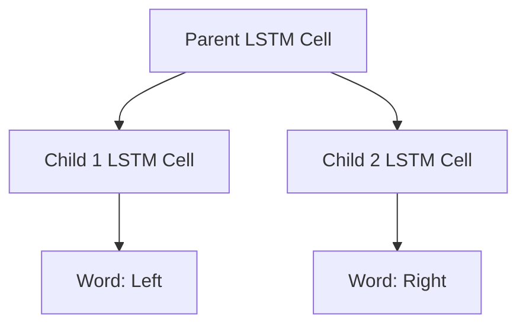

# Tree-LSTM

## Overview
Tree-LSTM, introduced in 2015 by Tai et al., is a core breakthrough in recursive language modeling. It generalized standard sequential Long Short-Term Memory (LSTM) networks to tree-structured topologies.

## Architecture & Mechanism
Instead of having a single previous hidden state, a Tree-LSTM unit can integrate hidden states from multiple child nodes simultaneously. This allows the model to capture complex syntactic structures and long-distance dependencies much more effectively than a standard sequential LSTM.

## Diagram

## References
- [Improved Semantic Representations From Tree-Structured Long Short-Term Memory Networks](https://arxiv.org/abs/1503.00075)
