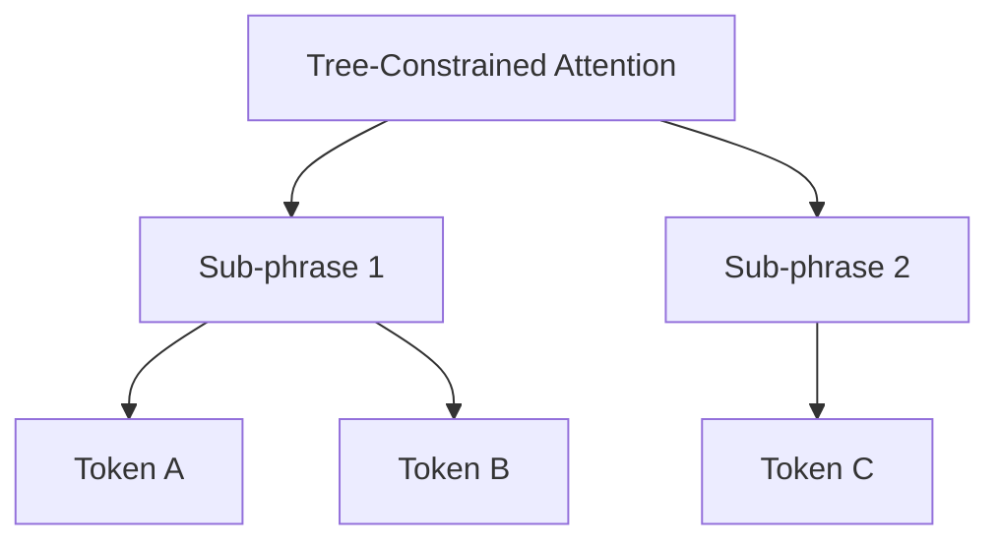

# Recursive Transformer / Tree-Transformer

## Overview
The Tree-Transformer (around 2019-Present) represents the modern convergence of recursive structures and the highly successful Transformer architecture.

## Architecture & Mechanism
It replaces classic recurrent matrix transformations with localized multi-head self-attention mechanisms bounded strictly by constitutional phrase structures. By integrating tree structures into self-attention, the model can capture hierarchical structures while benefiting from the parallelization and representation power of Transformers.

## Diagram

## References
- [Tree Transformer: Integrating Tree Structures into Self-Attention](https://arxiv.org/abs/1909.06639)
